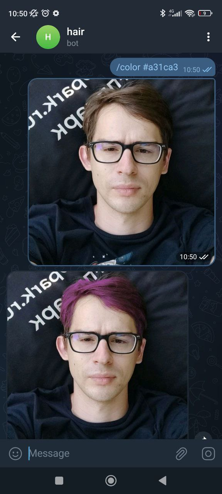

This repository contains a simple Python script which runs Mediapipe's hair segmentation model using OpenCV on RISC-V CPU.

1. Build OpenCV:
    ```bash
    docker build -t opencv opencv_riscv64
    docker run -v $(pwd):/mnt opencv sh -c "cp *.tar.gz /mnt"
    ```

2. Download deep learning [model](https://storage.googleapis.com/mediapipe-assets/hair_segmentation.tflite?generation=1661875756623461)

3. Start a telegram bot:

    ```bash
    python bot.py --token=xxx
    ```


